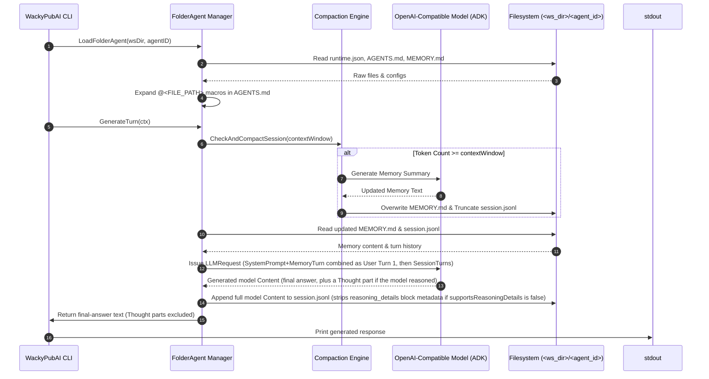

# 🏛️ WackyPubAI Architecture: Agent Session Management

This document details the architecture, directory specs, lifecycle, compaction mechanics, and Google Agent Development Kit (ADK) integration for agent sessions in **WackyPubAI**.

> This is the deep reference: full schemas, diagrams, and mechanics. For quick orientation when working in this repo, and for the *why* behind specific design choices, see [`.agents/AGENTS.md`](../.agents/AGENTS.md) and [`.agents/DECISIONS.md`](../.agents/DECISIONS.md).

---

## 📑 Table of Contents

1. [Overview](#1-overview)
2. [Workspace & Directory Structure](#2-workspace--directory-structure)
3. [File Specifications](#3-file-specifications)
   - [runtime.json](#runtimejson)
   - [AGENTS.md & Macro Expansion](#agentsmd--macro-expansion)
   - [MEMORY.md](#memorymd)
   - [session.jsonl](#sessionjsonl)
4. [Google ADK Integration Layer](#4-google-adk-integration-layer)
5. [Execution Lifecycle](#5-execution-lifecycle)
6. [Session Compaction Mechanics](#6-session-compaction-mechanics)
7. [Reasoning / Thinking Support](#7-reasoning--thinking-support)
8. [CLI Command Pipeline](#8-cli-command-pipeline)
9. [Session Locking](#9-session-locking)
10. [Programmatic Go SDK API](#10-programmatic-go-sdk-api-pkgagent)

---

## 1. Overview

WackyPubAI manages agents using a file-system-first architecture. Each agent operates within a dedicated directory located inside a workspace directory (`<ws_dir>`).

```
<ws_dir>/
└── <agent_id>/
    ├── runtime.json       # LLM Endpoint, Model & Compaction Settings (or Symlink)
    ├── AGENTS.md          # System Prompt with @<FILE_PATH> Macro Inclusions
    ├── MEMORY.md          # Long-term Compacted Memories
    ├── session.jsonl      # Sequential Turn History Log (JSON Lines)
    └── session.lock       # PID-based Exclusive Process Lock
```

By decoupling runtime configuration, system prompts, memory, and turn logs into discrete files, agent state is human-readable, source-controllable, and easily inspectable.

---

## 2. Workspace & Directory Structure

- **Workspace Directory (`<ws_dir>`)**: Defaults to the current working directory (`.`). Can be overridden globally via the `--ws <path>` CLI flag.
- **Agent Directory (`<ws_dir>/<agent_id>/`)**: Contains all runtime configuration, prompt templates, memory, and turn data for `<agent_id>`.

---

## 3. File Specifications

### `runtime.json`

Specifies the LLM provider configuration and session compaction parameters for the agent.

> 💡 **Symlink Support**: `runtime.json` may be a symbolic link to a shared global configuration file (e.g. `../shared_runtime.json`). The runtime loader evaluates symlinks automatically via `filepath.EvalSymlinks`.

#### Schema
```json
{
  "endpoint": "https://api.openai.com/v1",
  "model": "gpt-4o",
  "apiKey": "sk-...",
  "sessionCompactPct": 50.0,
  "contextWindow": 128000,

  "preserveThinking": false,
  "reasoningEgress": "",
  "reasoningField": "",
  "supportsReasoningDetails": false,
  "extraBody": {}
}
```

#### Fields
| Field | Type | Description |
|---|---|---|
| `endpoint` | `string` | OpenAI-compatible HTTP base URL (e.g., `https://api.openai.com/v1`, `https://openrouter.ai/api/v1`, `http://localhost:11434/v1`). Empty falls back to native Gemini via `GEMINI_API_KEY`/`--api-key`. |
| `model` | `string` | Target LLM model identifier (e.g., `gpt-4o`, `anthropic/claude-haiku-4.5`, `auto` for OpenRouter's model router). |
| `apiKey` | `string` | Bearer token / API key for authentication. |
| `sessionCompactPct` | `float64` | Percentage of session turns to consume/compact during compaction (default: `50.0`). |
| `contextWindow` | `int` | Optional maximum token threshold triggering auto-compaction. `0` disables auto-compaction. |
| `preserveThinking` | `bool` | Set for backends that resend and bill for prior reasoning text on every turn (e.g. Kimi K2 Thinking, DeepSeek V4 thinking mode). When true, the compaction token estimate counts `Thought`-marked part text, since it's actually replayed to the model on every subsequent request. Leave `false` for backends that drop/ignore replayed reasoning by default (e.g. Qwen3). See [§7](#7-reasoning--thinking-support). |
| `reasoningEgress` | `string` | Wire shape used to send reasoning back as history: `""`/`"native"` (own field, required by DeepSeek V4 thinking mode & Kimi K2 Thinking), `"think_tags"` (folded into `content` as a `<think>` block, for backends that 400 on an unknown field), or `"omit"` (send no reasoning at all). |
| `reasoningField` | `string` | Name of the provider's plain-text reasoning field, read on ingest and written on egress. Empty means `"reasoning_content"`. OpenRouter uses `"reasoning"` instead. |
| `supportsReasoningDetails` | `bool` | Allows OpenRouter's structured `reasoning_details` block array (including encrypted/signed reasoning) to be replayed as history. Only safe with a **pinned** `model` — see [§7](#7-reasoning--thinking-support) for why `"auto"` routing breaks this. |
| `extraBody` | `map[string]any` | Provider-specific fields merged into the root of every request body, for extensions Chat Completions doesn't define — e.g. `{"reasoning": {"effort": "high"}}` to request extended thinking from OpenRouter-routed models that don't emit it by default. |

---

### `AGENTS.md` & Macro Expansion

`AGENTS.md` defines the base system prompt instructions for the agent.

#### `@<FILE_PATH>` Macro Expansion
To promote modular prompts, `AGENTS.md` supports embedding secondary files using the `@<FILE_PATH>` macro syntax:

```markdown
# Role: Archmage Ignis
You are Ignis, an ancient wizard.

@rules/spells.md
@prompts/personality.txt
```

#### Macro Resolution Rules:
1. File paths after `@` are resolved relative to the agent's directory (`<ws_dir>/<agent_id>/`).
2. Macro expansion works recursively (files included via `@` can themselves contain `@` macros).
3. Circular imports (e.g., File A imports File B which imports File A) are detected and omitted safely.
4. Maximum expansion recursion depth is capped at 10 to prevent stack overflow.

---

### `MEMORY.md`

`MEMORY.md` contains long-term, compacted memory facts and relationship state for the agent.

#### Key Mechanics:
- If `MEMORY.md` does not exist in `<agent_id>/`, it is treated as empty (`""`).
- **Hardcoded Context Position (User Turn 1)**: There is no separate "system" role message. Instead, the fully rendered `AGENTS.md` system prompt and the current contents of `MEMORY.md` are combined into a **single first user turn**, sent as plain user-role text (not a `system`/`developer` role message) for broad compatibility across OpenAI-compatible backends — some local model chat templates don't handle a `system` turn correctly, so folding it into the first user message is the one behavior that works everywhere:
  ```
  <rendered AGENTS.md system prompt>

  <PERSISTENT_MEMORY>
  <contents of MEMORY.md>
  </PERSISTENT_MEMORY>
  ```
- **Prefix Consistency**: Both normal generation (`GenerateTurn`) and compaction (`CheckAndCompactSession`) build this exact same first-turn text, so the conversation prefix stays identical between the two, maximizing LLM prompt cache performance.

---

### `session.jsonl`

`session.jsonl` stores the conversation turn history log in JSON Lines format (one JSON object per line). Each line is a serialized [`genai.Content`](https://pkg.go.dev/google.golang.org/genai#Content) — not a custom struct — so it natively supports multi-part messages, including reasoning/thinking, images, and other multimedia, with no lossy round-trip through a text-only format.

#### Schema per line
```json
{"role": "user", "parts": [{"text": "Hello, traveler!"}]}
{"role": "model", "parts": [{"text": "Let me think about how to greet them...", "thought": true}, {"text": "Greetings! What brings you to my tavern?"}]}
```

#### Rules:
- Roles are `"user"` and `"model"` (the ADK/`genai` convention), not `"user"`/`"assistant"`.
- There is no `timestamp` field — `genai.Content` doesn't have one, and none is added.
- The system prompt is **never stored** inside `session.jsonl` — it's re-rendered from `AGENTS.md` and injected fresh into the first turn on every generation (see [MEMORY.md](#memorymd) above).
- A `Part` with `"thought": true` holds reasoning/chain-of-thought text captured from the model, kept separate from the final-answer part(s). See [§7](#7-reasoning--thinking-support).
- A part can also carry a `partMetadata` object holding an opaque, provider-specific block (e.g. OpenRouter's `reasoning_details`, including encrypted/signed reasoning) — see [§7](#7-reasoning--thinking-support).

---

## 4. Google ADK Integration Layer

WackyPubAI integrates with **Google Agent Development Kit v2** (`google.golang.org/adk/v2`) for its core types (`model.LLM`, `model.LLMRequest`/`LLMResponse`, `agent.Agent`, `session.Event`), but the primary `generate`/`prompt` CLI path talks to the model directly rather than routing through ADK's `LLMAgent`/`Runner` machinery — `FolderAgent.GenerateTurn` (`pkg/agent/agent_folder.go`) builds the `model.LLMRequest` by hand (system prompt + memory folded into the first turn, plus `session.jsonl` history) and calls `model.LLM.GenerateContent` directly:

```
┌─────────────────────────────────────────────────────────────┐
│                      WackyPubAI CLI                         │
└──────────────────────────────┬──────────────────────────────┘
                               │
                               ▼
┌─────────────────────────────────────────────────────────────┐
│         FolderAgent.GenerateTurn (pkg/agent/agent_folder.go) │
│   builds model.LLMRequest by hand, calls model.LLM directly  │
└──────────────────────────────┬──────────────────────────────┘
                               │
                               ▼
┌─────────────────────────────────────────────────────────────┐
│              OpenAI-Compatible ADK Model Adapter             │
│   pkg/agent/openai_model.go -> adk-utils-go's genai/openai   │
│      (official github.com/openai/openai-go/v3 SDK underneath) │
└──────────────────────────────┬──────────────────────────────┘
                               │ HTTP POST /chat/completions
                               ▼
┌─────────────────────────────────────────────────────────────┐
│               OpenAI-Compatible LLM Provider                │
│  (OpenAI, OpenRouter, DeepSeek, Kimi, vLLM, Ollama, llama.cpp) │
└─────────────────────────────────────────────────────────────┘
```

A separate `BuildADKAgent`/`llmagent.New` construction (`pkg/agent/adk_agent.go`) and `FolderAgent.RunWithRunner` (using ADK's `runner.Run`) exist as an alternate entry point for orchestrating through ADK's actual `LLMAgent`/`Runner` pipeline — this path is not used by the `generate`/`prompt` CLI commands today.

### OpenAI Adapter: `github.com/colinrgodsey/adk-utils-go` Fork

`pkg/agent/openai_model.go`'s `NewOpenAIModel` is a thin wrapper around [`achetronic/adk-utils-go`](https://github.com/achetronic/adk-utils-go)'s `genai/openai` package, which itself wraps the official `openai-go/v3` SDK. `go.mod` currently points at **a fork**, `github.com/colinrgodsey/adk-utils-go`, via a `replace` directive, because the upstream adapter read reasoning/thinking correctly on ingest but lost it (or mangled it) on egress — see [§7](#7-reasoning--thinking-support) and `ADK_UTILS_GO_REASONING_EGRESS_BUG.md` at the repo root for the original bug writeup. Update the `replace` directive's pinned commit whenever the fork gets new fixes:

```bash
go mod edit -replace github.com/achetronic/adk-utils-go=github.com/colinrgodsey/adk-utils-go@master
go mod tidy
```

Drop the `replace` directive entirely once the fix lands upstream and is tagged.

### ADK `llmagent.Config` Mapping (alternate `RunWithRunner` path)

1. **`Name`**: Set directly to `agentID` (which is already unique within the workspace directory).
2. **`Instruction`**: Set to the fully rendered system prompt string loaded from `AGENTS.md` (after processing `@<FILE_PATH>` macro inclusions).
3. **`Model`**: The configured `model.LLM` instance (OpenAI-compatible adapter or native Gemini).

```go
ag, err := llmagent.New(llmagent.Config{
    Name:        agentID,
    Description: fmt.Sprintf("Agent %s", agentID),
    Instruction: renderedPrompt, // Fully expanded AGENTS.md
    Model:       llmModel,
})
```

---

## 5. Execution Lifecycle

When running `wackypub agent <agent_id> generate`:



---

## 6. Session Compaction Mechanics

Compaction prevents conversation history from exceeding LLM context boundaries while preserving prefix caching.

### Normal Session Context Layout
1. **User Turn 1**: Fully rendered `AGENTS.md` system prompt, followed by `<PERSISTENT_MEMORY>\n<contents of MEMORY.md>\n</PERSISTENT_MEMORY>` — combined into one plain user-role turn (no `system`-role message is sent at all; see [MEMORY.md](#memorymd)).
2. **Session Turns**: All turns from `session.jsonl` (`user` / `model`).

### Compaction Session Context Layout
When `estimatedTokens >= contextWindow`:
1. **User Turn 1**: Same combined system-prompt + `<PERSISTENT_MEMORY>` text as normal generation *(identical prefix, for prompt caching)*.
2. **Archived Turns**: First X% of turns from `session.jsonl` (`compactTurns`), then extended forward if needed until the boundary lands right after a `model` turn — so the surviving session (`remainingTurns`) always starts fresh on a `user` turn, never a dangling assistant response whose prompting user turn just got archived.
3. **Compaction Directive (User Turn)**: the exact wording lives in `CompactionDirectivePrompt` (`pkg/agent/compaction.go`) — read it there rather than here, since it's tuned periodically and a copy in this doc would drift out of sync. Broadly: instructs the model to generate a concise, chronological markdown ADDENDUM capturing new developments from the archived turns (without repeating what `<PERSISTENT_MEMORY>` already has), and explicitly defers to any additional memory-focus guidance the agent's own `AGENTS.md` provides (e.g. a `## Memory Focus` section — see `test_agents/bob/AGENTS.md` for an example).

### Memory Update & Session Pruning:
1. The LLM generates a bulleted markdown **ADDENDUM** (extracted via `ContentText`, which excludes `Thought`-marked parts — reasoning never leaks into `MEMORY.md`).
2. The addendum is **appended directly** to `<agent_id>/MEMORY.md`.
3. The archived turns (`compactTurns`) are removed from `session.jsonl`, keeping only `remainingTurns`.

### Token Estimation

`EstimateTokens` uses a `~4 chars/token` heuristic over turn text. Whether `Thought`-marked reasoning text counts toward that estimate depends on `runtime.json`'s `preserveThinking` (see [§3](#runtimejson)): if the backend actually resends and bills for reasoning on every turn, thinking should count against the budget; if the backend drops or ignores replayed reasoning, it shouldn't.

---

## 7. Reasoning / Thinking Support

Backends vary widely in how they expose and expect back a model's reasoning/chain-of-thought, and getting this wrong ranges from "wastes tokens" to "hard 400 error." This is handled by the OpenAI adapter (`pkg/agent/openai_model.go`, backed by the `colinrgodsey/adk-utils-go` fork — see [§4](#4-google-adk-integration-layer)) plus a few `runtime.json` knobs.

### Ingest

Reasoning is captured **unconditionally** on ingest, regardless of `runtime.json` settings — a plain-text reasoning field (`reasoningField`, default `"reasoning_content"`) becomes a `Thought`-marked `genai.Part`, and OpenRouter's structured `reasoning_details` blocks (including opaque encrypted/signed reasoning) are captured verbatim into `partMetadata` under the adapter's `ReasoningDetailMetadataKey`. This is why reasoning shows up in `session.jsonl` even for agents where egress is disabled — capture and replay are independently controlled.

### Egress

Controlled by `reasoningEgress` and `supportsReasoningDetails`:
- **`native`** (default): reasoning is sent back as its own field (named by `reasoningField`) on the assistant message, separate from `content`. Required by DeepSeek V4 thinking mode and Kimi K2 Thinking, which 400 if it's missing.
- **`think_tags`**: reasoning is folded into `content`, wrapped in a `<think>...</think>` block, for backends that reject an unrecognized field with a 400 (observed on Mistral, TensorRT-LLM, some gateways).
- **`omit`**: no reasoning is sent at all.
- **`supportsReasoningDetails: true`**: additionally replays OpenRouter's structured `reasoning_details` block array verbatim (unmodified, unreordered — the sequence has to match what the model produced). **Only safe with a pinned `model`** — encrypted/signed reasoning blocks are tied to the exact backend endpoint that produced them, and OpenRouter's `"auto"` router can pick a different endpoint on the next turn, which gets rejected with a 404 ("Encrypted payloads can only be replayed to the endpoint that created them"). If `supportsReasoningDetails` is `false`, `StripReasoningDetails` removes any captured block metadata before a turn is persisted to `session.jsonl`, so a block captured while the setting was on doesn't sit around as dead weight (or a future stale-endpoint landmine) after it's turned off.

### Forcing extended thinking

Some models (e.g. Claude via OpenRouter) don't emit reasoning by default — it has to be explicitly requested via `extraBody`:
```json
"extraBody": {
  "reasoning": { "effort": "high" }
}
```

### Display vs. storage

`ContentText` (used for the CLI's printed/returned response, and for `MEMORY.md` addenda) always excludes `Thought`-marked parts — reasoning is preserved in `session.jsonl` for full fidelity, but never shown as if it were the character's actual dialogue.

### Manually stripping stale reasoning_details

If an agent's `session.jsonl` already contains `reasoning_details` block metadata from a prior backend (e.g. it was run against `"model": "auto"` on OpenRouter and picked up an encrypted block), and you're permanently moving it to a different model/endpoint, that stale block is a landmine — see [`wackypub agent <agent_id> strip-reasoning`](#8-cli-command-pipeline) below. It removes only the block metadata; readable `Thought` text is left in place.

---

## 8. CLI Command Pipeline

### Add User Turn (`add`)
```bash
wackypub agent <agent_id> add [message]
```
- Accepts message via positional argument, `-m / --message` flag, or piped stdin.
- Appends `{"role": "user", "parts": [{"text": message}]}` to `<ws_dir>/<agent_id>/session.jsonl`.

### Generate Assistant Turn (`generate`)
```bash
wackypub agent <agent_id> generate
```
- Loads agent from `<ws_dir>/<agent_id>`.
- Evaluates compaction triggers.
- Builds the request contents (system prompt + memory turn, then `session.jsonl` history) and passes them through `MergeConsecutiveUserTurns` — collapsing any run of consecutive `user` turns (e.g. from multiple prior `add` calls) into one multi-part message before it's sent, since many backends reject or mishandle non-alternating roles. `session.jsonl` itself is untouched by this — it's a request-time normalization, not a storage-time one.
- Generates a turn by calling the configured `model.LLM` directly (see [§4](#4-google-adk-integration-layer)).
- Prints final-answer text to `stdout` (`Thought` parts excluded).
- Appends the full generated `genai.Content` — including any `Thought` part — to `<ws_dir>/<agent_id>/session.jsonl`.

### Atomic Prompt Turn (`prompt`)
```bash
wackypub agent <agent_id> prompt [message]
```
- **Atomically** appends the user message and generates the assistant response under a **single session lock**.
- Prevents race conditions when multiple processes target the same agent (e.g. consecutive user turns without an assistant response between them) — and even if consecutive user turns do end up in `session.jsonl` (via `add`, or just because the persistent-memory turn precedes the first real user turn), `generate`'s merge step (above) still normalizes them before the request goes out.
- Accepts message via positional argument, `-m / --message` flag, or piped stdin.
- Prints generated assistant text to `stdout`.
- **Recommended over separate `add` + `generate`** for most use cases.

### Strip Reasoning Details (`strip-reasoning`)
```bash
wackypub agent <agent_id> strip-reasoning
```
- Permanently removes OpenRouter `reasoning_details` block metadata (including encrypted/signed reasoning tied to a specific backend endpoint) from every turn in `<ws_dir>/<agent_id>/session.jsonl`, rewriting the file in place under the session lock.
- Readable plain-text `Thought` reasoning is left untouched — only the opaque `partMetadata` block is removed.
- Prints the number of turns modified.
- Use this when permanently switching an agent to a different model/endpoint after it accumulated encrypted reasoning blocks from the old one — see [§7](#7-reasoning--thinking-support).

### Read Session (`read-session`)
```bash
wackypub agent <agent_id> read-session
```
- Prints every turn in `<ws_dir>/<agent_id>/session.jsonl` to stdout, one JSON-encoded `genai.Content` per line (same shape as the file itself).
- Read-only.

### Read Memory (`read-memory`)
```bash
wackypub agent <agent_id> read-memory
```
- Prints the current contents of `<ws_dir>/<agent_id>/MEMORY.md` to stdout. Empty output (no error) if the file doesn't exist yet.
- Read-only.

### Render System Prompt (`render-prompt`)
```bash
wackypub agent <agent_id> render-prompt
```
- Prints the fully rendered system prompt — `AGENTS.md` (or the generic fallback if missing) after `@<FILE_PATH>` macro expansion — exactly the text that becomes part of the first turn on every generation (see [MEMORY.md](#memorymd)).
- Does **not** construct a model and does not require `runtime.json` to exist or be valid — works for validating `AGENTS.md`/macro output even before the agent's backend is configured.
- Read-only.

### Compact (`compact`)
```bash
wackypub agent <agent_id> compact
```
- Manually runs the same compaction check `generate`/`prompt` run automatically (see [§6](#6-session-compaction-mechanics)). No-op, not an error, if the session is under `contextWindow` or `contextWindow` is unset.
- Prints whether compaction actually ran.

### Workspace Diagnostics (`workspace`)
```bash
wackypub workspace
wackypub workspace <agent_id>
```
This is a top-level command (`wackypub workspace ...`, not `wackypub agent ... workspace`) — see [§4](#4-google-adk-integration-layer) and `.agents/AGENTS.md` for why: it's meant as a self-service way for an agent platform to discover how to structure a workspace, rather than a prose doc that can drift from what the code actually does.
- No argument: lists every agent directory found directly under `--ws` (a directory counts as an agent directory if it directly contains at least one of `AGENTS.md`, `runtime.json`, or `session.jsonl` — a directory like `testws/runtimes/` used only to hold shared `runtime.json` variants to symlink from is correctly excluded), with a one-line status per agent: `runtime.json` present/valid, `session.jsonl` turn count (and corrupt-line count if nonzero), whether `MEMORY.md` exists.
- With `agent_id`: detailed on-disk state for that one agent — every expected file's presence, `runtime.json`'s resolved path if it's a symlink and whether it parses, session turn count, and an explicit "Issues" list for anything broken (missing/invalid `runtime.json`, a broken symlink, corrupt `session.jsonl` lines). Works even if the agent directory doesn't exist yet — in that case it explains what to create instead of erroring.
- **Read-only**: never creates or modifies a file, including not creating the agent directory just from being asked about a nonexistent one (unlike most other `AgentSDK` methods, which call `os.MkdirAll` on the agent directory as a side effect).

---

## 9. Session Locking

All SDK operations acquire an exclusive POSIX file lock (`flock`) on `<agent_id>/session.lock` before reading or writing session state.

### Mechanics
- **Lock file**: `<ws_dir>/<agent_id>/session.lock`
- **Lock type**: `syscall.Flock(fd, LOCK_EX)` — blocking exclusive lock.
- **PID visibility**: The current process PID is written to the lock file for diagnostic inspection.
- **Scope**: The lock is held for the duration of the SDK method call and released automatically via `defer`.

### Why It Matters
Without locking, concurrent CLI invocations (e.g. two terminals running `add` and `generate` against the same agent) can interleave writes to `session.jsonl`, producing consecutive same-role turns or corrupted state. The `prompt` command avoids this entirely by holding the lock across both the user append and assistant generation.

> ⚠️ **No defensive merging**: unlike the original hand-rolled adapter, the current OpenAI adapter (`achetronic/adk-utils-go` / the `colinrgodsey` fork) does **not** merge consecutive same-role turns before sending them — each `genai.Content` in `session.jsonl` maps to its own message on the wire. Under normal use (`add`/`generate`/`prompt`) turns always alternate correctly, but hand-editing `session.jsonl` into a non-alternating state can produce malformed requests against backends with a strict chat template. `session.lock` prevents the concurrent-write case; it doesn't fix manually-broken data (also watch for missing trailing newlines when hand-editing — a stripped final newline plus a subsequent append will silently merge two JSON objects onto one line, which `ReadSessionTurns` then silently skips as unparseable).

---

## 10. Programmatic Go SDK API (`pkg/agent`)

All agent functionality is exposed as a Go SDK (`agent.AgentSDK`) in `pkg/agent` for programmatic orchestration.

### Initializing the SDK
```go
import "github.com/colinrgodsey/WackyPubAI/pkg/agent"

// Initialize SDK for workspace directory
sdk := agent.NewSDK("./my_workspace")
```

### SDK Methods
```go
// Add a user message turn to session.jsonl (acquires session lock)
err := sdk.AddUserTurn("wizard", "Greetings! Tell me a rumor.")

// Generate the agent's turn response (acquires session lock, evaluates compaction & appends to session.jsonl)
respText, err := sdk.GenerateTurn(ctx, "wizard")

// Atomically add user message + generate assistant response under a single lock (recommended)
respText, err := sdk.AddAndGenerateTurn(ctx, "wizard", "Greetings! Tell me a rumor.")

// Read session history as []*genai.Content (acquires session lock)
turns, err := sdk.ReadSession("wizard")

// Read memory file (MEMORY.md) (acquires session lock)
mem, err := sdk.ReadMemory("wizard")

// Fully rendered system prompt (AGENTS.md + macro expansion) - no model constructed,
// doesn't require runtime.json (acquires session lock)
prompt, err := sdk.RenderSystemPrompt("wizard")

// Manually trigger session compaction evaluation (acquires session lock)
compacted, err := sdk.CompactSession(ctx, "wizard")

// Permanently strip OpenRouter reasoning_details block metadata from session.jsonl,
// returning the number of turns modified (acquires session lock)
modified, err := sdk.StripReasoningDetails("wizard")

// List agent IDs found directly under the workspace directory (no lock — only reads directory names)
ids, err := sdk.ListAgents()

// Report an agent's on-disk state (files present/missing, runtime.json validity, session/memory
// stats) — read-only, never creates the agent directory; acquires session lock only if it exists
insp, err := sdk.InspectAgent("wizard")

// Access underlying FolderAgent for ADK runner customization (no lock — caller manages locking)
fa, err := sdk.GetAgent("wizard")
```

